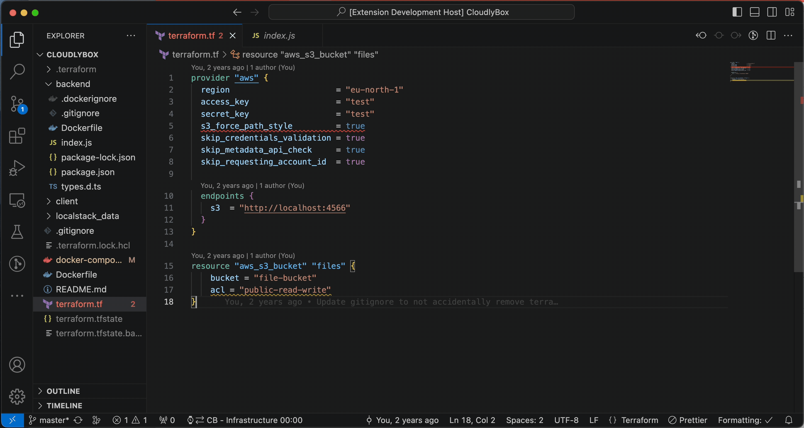

# Harvest Auto Switcher for Visual Studio Code

*NOTE:* Neither I, nor this extension, have any affiliation with [Harvest](https://harvestapp.com), nor do I guarantee any stable behaviour as it is still in alpha stage!

The Harvest Auto Switcher lets you handle your Harvest timesheets from within Visual Studio Code. It includes features to start and stop entries, update notes on entries as well as automatically switching tasks depending on which file or workspace you're currently editing.

[Documentation](https://spark-toothbrush-494.notion.site/Harvest-Time-Tracker-2fc066c098c9422bbb11fc228d08592a)

## Features



- `Set Harvest Access Token and Account` - Setup Harvest integration or change the access token used.
- `Start entry` - Starts time tracking under a certain project task. Asks you to add or update notes.
- `Stop entry` - Stops time tracking under a certain project task.
- `Set associated task` - Associates a certain project task with files under a certain folder, allowing the extension to automatically switch tasks based on the files you're editing. Associates current folder by default.
- `Remove associated task` - Allows you to remove from the saved list of associated tasks.
- `Toggle Switching` - Turns auto-switching on or off.

## Installation

Download the latest release `.vsix` file from the [repository](https://github.com/antonsivertsson/vscode-harvest-auto-switcher/releases) and install it using the following command:

```bash
code --install-extension <path/to/extension.vsix>
```

## Requirements

If you have any requirements or dependencies, add a section describing those and how to install and configure them.

## Development

Follow the guidelines for VS Code extension development in the [VS Code Extension API documentation](https://code.visualstudio.com/api).

### Requirements

- `pnpm`
- `vsce` to generate extension file - `npm install -g vsce`

### Tests

```bash
# Run test suite
pnpm test
```

## Release Notes

### 0.0.1

Initial alpha release of extension. Includes:

- Setup extension integration with Harvest
- Start/Stop entries (with optional notes)
- Experimental auto-switching support
